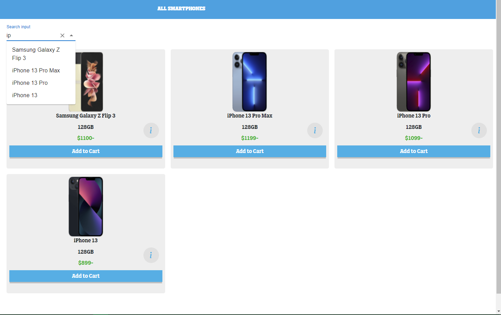

# Welcome to the Full stack MERN teleShop App [Demo](https://teleshop-97.herokuapp.com/)

#### This React project was a part of my study in HackYourFuture institute in Amsterdam

#### The app consists of the following parts:

1. **Home page** with show modals

   
   
2. **Shop page** where your find all devices available in our database with
   filters on brand/os/price and autoComplete search field; and popover to show
   the device specs ; notifications show up when item added to cart or removed
   from cart.
   
   
   <div style="display: flex; flex-wrap:wrap">
      
      
      
      
   </div>
   
   
3.  **Check out page** where you can pay using a credit card using Stripe API.

      
      
4.  **Sing up page** to register your information in our database.
5.  **Sing in page**.


   <div style="display: flex;justify-content:space-around">
      
      
   </div>


6. The App is mobile ***Responsive*** which means everything will fit well at small
   screens as well.

### Languages and tools:

#### Frontend:
- **ReactJs**
- **Javascript** 
- **CSS**

#### Backend:
- **NodeJs**
- **ExpressJs**
- **MongoDB**

#### Tools and npm:
- **mongoose**: to work with mongoDb.
- **bycrpt**: to hash passwords before saving them on database.
- **Material ui**: for Design.
#### APIs:
- Stripe API for payments.
___
### Test account:

- email: `test@gmail.com`
- password: `test123`
___

In case you want to run the app on your **local machine** follow the next steps please:

- After cloning the code into your machine please do the next steps:

### Run these commands in your terminal:

1. `cd react-project`
2. `npm install concurrently`
3. `npm run setup` to install npm for backend and frontend
4. In the config folder you will find `example.env` file, first you should
   rename it to `.env` and then include your mongoDB key and Stripe key as
   shown in the next Example:

   ```javascript

    NODE_ENV=development
    MONGODB_URL=''
    STRIPE_PRIVATE_KEY=''
    STRIPE_SUCCESS_URL='http://localhost:3000'
    STRIPE_CANCEL_URL='http://localhost:3000'

   ```
4. In your mongoDB Atlas create a database called react-project ***(don't forget to
   include the database name in the mongodb_url)***
5. Create collection and name it as `Devices`   
6. Import the `ExampleDevices.json` into your `Devices` collection. 
7.  Finally launch the app by running => `npm run dev`
   
### And that's it, the app now should run successfully on your machine.
____
## Folder Structure:

### Frontend:
```
client
 ┗ src
 ┃ ┣ assets
 ┃ ┃ ┗ fonts
 ┃ ┣ components
 ┃ ┃ ┣ filter                          ## contains the filters logic
 ┃ ┃ ┣ ShoppingCart                    ## everything related to shoppingCart 
 ┃ ┃ ┃                                 ## all other components     
 ┃ ┃ ┃   
 ┃ ┣ context                           ## contexts                          
 ┃ ┃ ┗ global
 ┃ ┃ ┃ ┣ GlobalContext.js
 ┃ ┃ ┃ ┣ GlobalReducer.js
 ┃ ┃ ┃ ┗ initialState.js
 ┃ ┣ pages                             ## contains different main pages
 ┃ ┣ Styles                            ## Styles for different components
 ┃ ┣ App.css
 ┃ ┣ App.js                            ## main app file
 ┃ ┗ index.js
```


### Backend:

```
server
 ┣ assets
 ┃ ┗ xiaomi-redmi-note10-pro.jpg       ## devices photos
 ┣ config
 ┃ ┣ db.js                             ## Database connection
 ┃ ┣ example.env
 ┃ ┗ ExampleDevices.json
 ┣ controllers                         ## endpoints controllers
 ┣ models                              ## database modals
 ┣ routes                                 
 ┣ .gitignore
 ┣ package-lock.json
 ┣ package.json
 ┣ README.md
 ┣ req.rest                            ## for endpoints testing
 ┗ server.js                           
```
